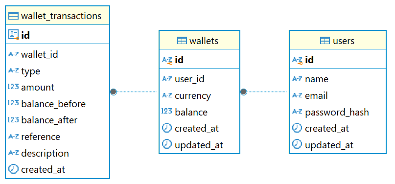

# Wallet Service

Wallet Service adalah backend service yang menyediakan fitur **registrasi & login user**, **manajemen wallet**, serta **deposit, withdraw, dan histori transaksi**. Project ini dibuat sebagai technical assignment dengan fokus pada _business logic_, _data consistency_, dan _API design_ yang clean serta mudah dipahami.

---

## ✨ Fitur Utama

- User **Register & Login** (JWT Authentication)
- List wallet milik user
- Cek saldo wallet
- Deposit saldo ke wallet
- Withdraw saldo dari wallet
- Riwayat transaksi wallet (CREDIT / DEBIT)
- Pagination & filter transaksi

---

## 🛠️ Tech Stack

- **Language**: Go (Golang)
- **Web Framework**: Gin
- **Database**: PostgreSQL
- **Authentication**: JWT (Bearer Token)
- **Database Access**: `gorm` + raw SQL
- **Migration & Command Runner**: custom CLI flags

---

## 📦 Arsitektur Singkat

Project ini menggunakan pendekatan **layered architecture**:

- **Handler / Controller** → HTTP layer
- **Service / Usecase** → Business logic
- **Repository** → Akses database

Semua operasi saldo (`deposit` & `withdraw`) selalu dilakukan dalam:

1. **Database transaction**
2. Update tabel `wallets`
3. Pencatatan histori transaksi ke `wallet_transactions`

---

## 🗄️ Database Schema

### users

- id
- name
- email
- password_hash
- created_at
- updated_at

### wallets

- id
- user_id
- currency
- balance
- created_at
- updated_at

### wallet_transactions

- id
- wallet_id
- type (CREDIT / DEBIT)
- amount
- balance_before
- balance_after
- reference
- description
- created_at

> `wallet_transactions` bersifat **immutable** (tidak memiliki `updated_at`).

---

## 🗂️ Database Schema Diagram

## 

---

## 🔐 Environment Variables (.env)

```env
# Application
APP_NAME=wallet-service
PORT=8080
LOG_LEVEL=6

# Database PostgreSQL
DB_USERNAME=root
DB_PASSWORD=root
DB_HOST=localhost
DB_PORT=5432
DB_NAME=wallet_service
DB_POOL_IDLE=10
DB_POOL_MAX=100
DB_POOL_LIFETIME=300

# JWT
JWT_SECRET=super_secret_key

# Cleanup
DROP_TABLE_NAMES=wallet_transactions,wallets,users
```

---

## 🚀 Cara Menjalankan Project

Project ini dapat dijalankan dalam beberapa mode CLI sesuai kebutuhan development.

### 1️⃣ Clone Repository

```bash
git clone https://github.com/hackim18/wallet-service.git
cd wallet-service
```

### 2️⃣ Mode Eksekusi

#### 🟢 Full Mode (Drop → Migrate → Seed → Run)

```bash
go run cmd/web/main.go --drop-table --migrate --seed --run
```

#### 🟡 Migrate → Seed → Run

```bash
go run cmd/web/main.go --migrate --seed --run
```

#### 🔵 Migrate + Run

```bash
go run cmd/web/main.go --migrate --run
```

#### 🟣 Hanya Menjalankan Server

```bash
go run cmd/web/main.go
```

#### 🧪 Hot Reload (Air)

```bash
air
```

Pastikan file `.air.toml` tersedia.

Server berjalan di:

```
http://localhost:8080
```

---

## 🔐 Authentication Flow

1. User **register**
2. User **login** dan menerima `access_token`
3. Request ke endpoint protected wajib mengirim header:

```http
Authorization: Bearer <access_token>
```

---

## 📌 API Endpoints

### 🔗 Postman Collection

- [https://api.postman.com/collections/33199697-c6176247-2eaf-444b-acad-8e04e140d614?access_key=PMAT-01KC3SFK00HCAE5TAG4AXR81E3](https://api.postman.com/collections/33199697-c6176247-2eaf-444b-acad-8e04e140d614?access_key=PMAT-01KC3SFK00HCAE5TAG4AXR81E3)
- Atau gunakan file `api/wallet-service.postman_collection.json` di repo

---

### 👤 Auth

#### Register

```
POST /api/users/register
```

Body:

```json
{
  "email": "johndoe@mail.com",
  "password": "12345678",
  "name": "John Doe"
}
```

#### Login

```
POST /api/users/login
```

Body:

```json
{
  "email": "johndoe@mail.com",
  "password": "12345678"
}
```

---

### 💼 Wallet

#### List Wallet User

```
GET /api/wallets
```

#### Get Wallet Balance

```
GET /api/wallets/:wallet_id/balance
```

#### Deposit Wallet

```
POST /api/wallets/:wallet_id/deposit
```

Body:

```json
{
  "amount": 50000,
  "reference": "BANK_TRX_00112233",
  "description": "Topup via BCA"
}
```

`reference` digunakan sebagai **identifier transaksi eksternal** dan membantu audit/idempotency.

#### Withdraw Wallet

```
POST /api/wallets/:wallet_id/withdraw
```

Body:

```json
{
  "amount": 20000,
  "reference": "WITHDRAW_001",
  "description": "Withdraw to bank"
}
```

#### Wallet Transactions

```
GET /api/wallets/:wallet_id/transactions?page=1&size=10&type=CREDIT
```

Query Params:

- `page` (default: 1)
- `size` (default: 10)
- `type` (optional: CREDIT / DEBIT)

---

## ✅ Business Rules

- User mendapatkan **wallet default** saat register
- Saldo menggunakan **integer** (tidak ada floating)
- Withdraw gagal jika saldo tidak mencukupi
- Deposit & withdraw **selalu tercatat** dalam `wallet_transactions`
- User **tidak dapat mengakses wallet milik user lain**

### 🔒 Transaction Safety

- Semua operasi saldo menggunakan **database transaction**
- Menggunakan **row-level locking** untuk mencegah race condition
- Saldo **tidak akan pernah negatif**

---

## 📝 Notes

Project ini menunjukkan kemampuan dalam:

- Perancangan business logic sistem keuangan
- Transaction handling
- Secure authentication & authorization
- Clean RESTful API design

---

## 👨‍💻 Author

**Khakim**

- GitHub: [https://github.com/hackim18](https://github.com/hackim18)
- Portfolio: [https://hackimdev.com/](https://hackimdev.com/)
- LinkedIn: [https://linkedin.com/in/khakim18](https://linkedin.com/in/khakim18)

---

## 📄 License

Project ini menggunakan MIT License. Lihat file `LICENSE` untuk detail.
